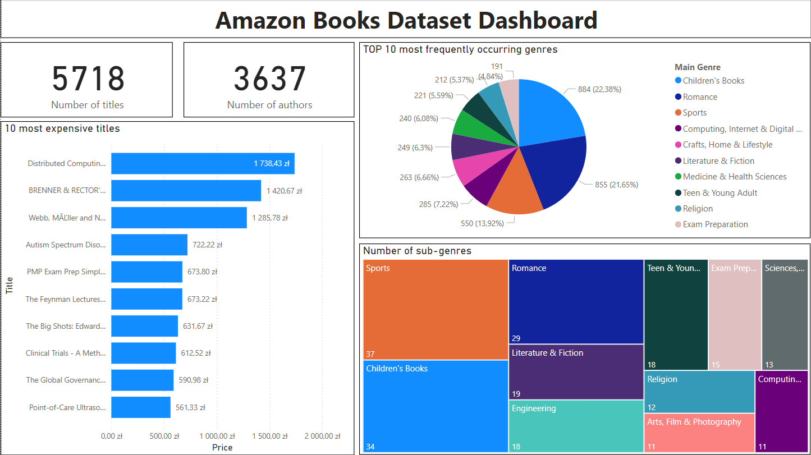
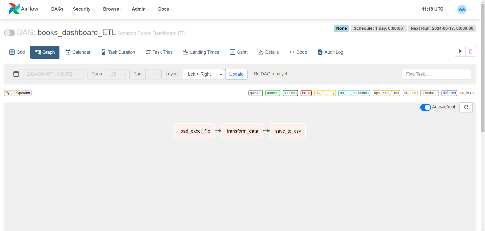

# Airflow Books ETL Project

## Project Overview

This project automates the Extraction, Transformation, and Loading (ETL) process of Amazon books data using Apache Airflow. The extracted data is transformed into a structured format suitable for analysis and visualization in tools like Power BI.

### Project Structure
├── dags  
&nbsp; └── books_dashboard_ETL.py     
├── dashboard  
&nbsp; └── books_extracted.csv    
&nbsp; └── Books_dashboard.pbix   
├── data  
&nbsp; └──Books_df.csv      
&nbsp; └── Genre_df.csv   
├── images               
&nbsp; └── README.md      

## DAG Description

The Airflow DAG automates the following tasks:

1. **load_files**: Loads raw CSV data (`Books_df.csv`, `Genre_df.csv`) into Pandas DataFrames and saves them as Pickle files (`Books_df.pkl`, `Genre_df.pkl`).

2. **transform_data**: Transforms the loaded data:
   - **books_transform**: Cleans `Books_df.pkl` by removing duplicates, converting prices to USD, and selecting relevant columns.
   - **genre_trnsform**: Cleans `Genre_df.pkl` by removing duplicates and selecting relevant columns.
   - Merges transformed data based on the 'Main Genre'.

3. **save_to_csv**: Saves the final processed data (`books_extracted.pkl`) as a CSV file (`books_extracted.csv`) in the `dashboard` folder for use in Power BI.

4. **remove_useless_files**: Deletes intermediate Pickle files (`Books_df.pkl`, `Genre_df.pkl`, `books_extracted.pkl`) to save storage space.

## Usage

### Setup

1. **Install Apache Airflow**: Ensure Apache Airflow is installed and configured on your system.

2. **Clone the Repository**: Clone this repository to your local machine.

3. **Deploy DAG**: Place the `books_dashboard_ETL.py` file in the Airflow `dags` directory.

### Running the DAG

- The DAG is scheduled to run daily (`schedule_interval=timedelta(days=1)`).
- Alternatively, trigger the DAG manually from the Airflow UI for ad-hoc execution.

### Accessing Processed Data

- Processed data (`books_extracted.csv`) is available in the `dashboard` folder after each successful DAG run.

### Power BI Integration

- **Import `books_extracted.csv`**: Use the `books_extracted.csv` file in Power BI to create insightful visualizations and reports based on the processed data.
- **Dashboard File**: The `Books_dashboard.pbix` file in the `dashboard` folder is a pre-configured Power BI dashboard that you can further customize based on your analysis requirements.

## Requirements

Ensure you have the following installed:

- Python 3.x
- Apache Airflow
- Pandas
- Power BI Desktop (for viewing/editing the dashboard)

## DAG Visualization

